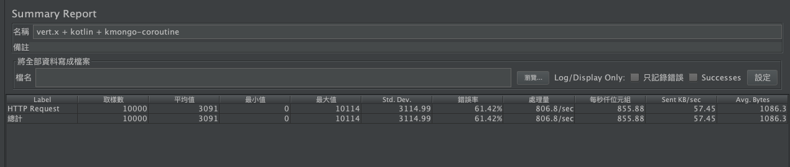
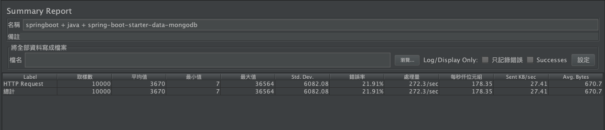

# kotlin-kmongo-coroutines-iv

kotlin-kmongo-coroutines-iv 為 vert.x 搭配 kotlin 及 kmongo 實作的 coroutines 版本

# springboot-mongo-iv

springboot-mongo-iv 為 sprinboot 搭配 java 及 spring-boot-starter-data-mongodb 實作的版本(為壓力測試比較而實作)

# postman-request-config

postman-request-config 為 postman request 設定檔(可直接匯入postman做測試)

# performance-testing

performance-testing 為 kotlin-kmongo-coroutines-iv 及 springboot-mongo-iv 使用 jmeter 壓力測試結果，
模擬狀況為瞬間對 「  http://localhost:8080/movie/starwars  」 這隻API 做10000個請求，其結果如下圖。

  - kotlin-kmongo-coroutines-iv


  - springboot-mongo-iv


## API

The application exposes a REST API for getRating movies:

You can know more about a movie

```
> curl http://localhost:8080/movie/starwars
{"id":"starwars","title":"Star Wars"}
```

You can get the current getRating of a movie:

```
> curl http://localhost:8080/getRating/indianajones
{"id":"indianajones","getRating":6}
```

Finally you can rateMovie a movie

```
> curl -X POST http://localhost:8080/rateMovie/starwars?getRating=4
```
